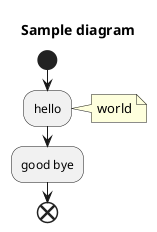

# IntelliJ Idea - assorted tips

## Index

- [Switching keyboard focus](#switching-keyboard-focus)
- [Manipulating tool windows](#manipulating-tool-windows)
- [Editing with multiple carets](#editing-with-multiple-carets)
- [Favorites](#favorites)
- [Markdown support](#markdown-support)

## Cool Features

### Switching keyboard focus

You can switch keyboard focus to various windows with keyboard shortcuts:

| Window         | Shortcut      |
| -------------- | ------------- |
| Editor         | Esc           |
| Navigation bar | Alt+Home      |
| Explorer       | Alt+1         |
| Favorites      | Alt+2         |
| Structure      | Alt+7         |
| Version control| Alt+9         |
| Terminal       | Alt+F12       |

### Manipulating tool windows

You can close all tool windows with **Ctrl+Shfit+F12**.

To open/close tool window press corresponding **Alt+** combination. 

You can jump to last active tool window with **F12**.

On the sides and bottom of main window there are tool window bars.
You can show/hide them with icon in the bottom-left corner.

It is possible to save current arrangement of tool windows 
(which ones are opened and their size etc.) in 
**Window | Store Current Layout as Default** and then you can restore it 
at any time with **Shift+F12**.

### Editing with multiple carets

To add carets above or below, tap **Ctrl twice** and press up or down arrow
while holding the second ctrl press.

To add caret with mouse press **Shift+Flt** and then click.

To enable/disable column selection press **Shift+Alt+Insert**.

To select occurrences press **Alt+J** multiple times or **Ctrl+Shift+Alt+J**
to select all at once.

### Favorites

With **Alt+2** you can view Favorites tool window. 

You can create favorite categories, and then you can add files to those categories.
Those would be files you find yourself viewing or editing often.

### Markdown support

**Preview**

For preview, there is a bundled Markdown plugin, 
which needs to be installed and enabled for this feature to work.

**Structure navigation**

Try **structure view** (Alt+7) or **structure navigation** (Ctrl+F12) 
when editing markdown file.

**Diagramming**

You can use PlantUML or DOT to define diagrams in your markdown. 

To reder PlantUML you need to install support for it. 
Go to the Languages & Frameworks | Markdown page, 
and click the Install button next to the 
PlantUML framework isn't installed warning

